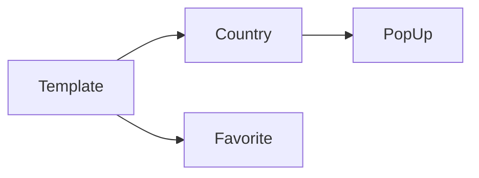
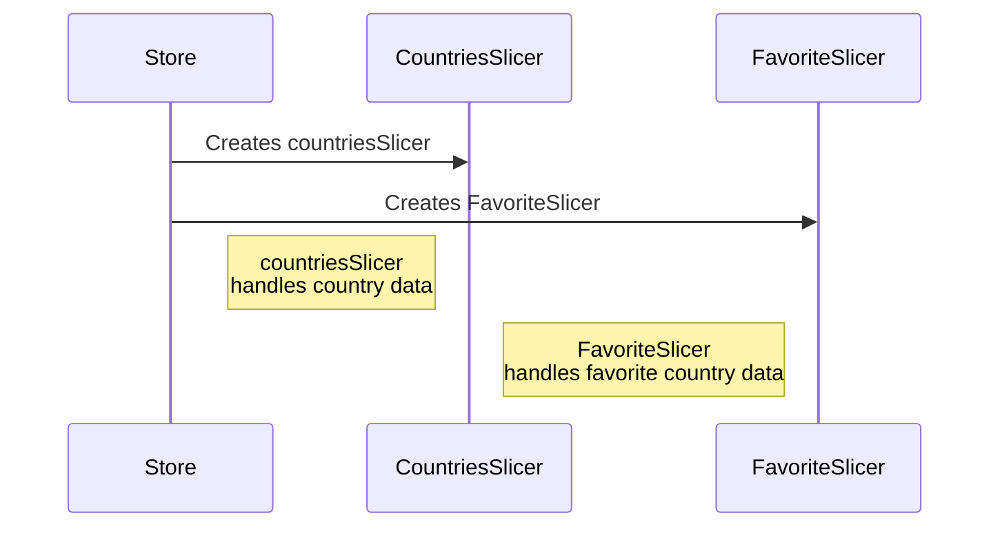

# Project create countries Data and Weather.

## Technology:

1. React TS
2. Store

## Function vs Data

1. Display all Countries data by fetching data from

```js
BASE_COUNTRIES_GETALL = "https://restcountries.com/v3.1/all";
```

2. Display Weather data each country from

```js
BASE_URL_WEATHER = "https://openweathermap.org/";
```

3. Store user Favorite Countries. 


## Router Set Up:



## Store Set Up:


