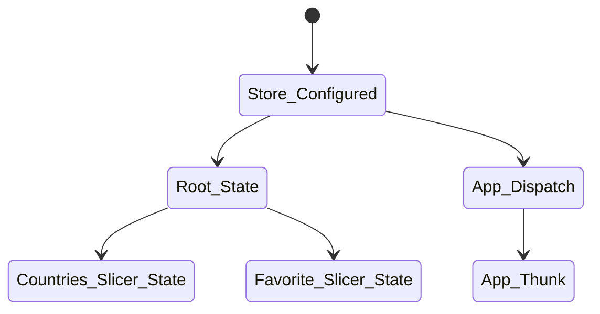

# Project create countries Data and Weather.

🇦🇶🇧🇦🇩🇯🇨🇷🇧🇹
1. project aim to fetch country data and show countries's details
2. user's can login/register
3. Project is a part of React-Learing-Module in Helsinki Bussiness College. 
4. Project's Teacher: Martin Holland 👉( <a href='https://github.com/martin-holland'>Link Github </a>🇹🇩)👈
## Technology:

| Teachnology         |                   |
| ------------------- | ----------------- |
| 1.Frontend          | React TS          |
| 2. State Management | Redux-Tool-Kit    |
| 3. UI Library       | Css and Tailwinds |
| 4. Authentication   | Firebase          |

## Install vs Run:

```
npm install
```
```
npm run start
```

## Function vs Data

1. Display all Countries data by fetching data from

```js
BASE_COUNTRIES_GETALL = "https://restcountries.com/v3.1/all";
```

2. Display Weather data each country from

```js
BASE_URL_WEATHER = "https://openweathermap.org/";
```

3. Store user Favorite Countries.

## Router Set Up:

```mermaid
graph LR;
    Template-->Firebase : Authentication
    Firebase-->Country
    Firebase-->Favorite
    Country-->Countries_Details

```

## Store Set Up:


